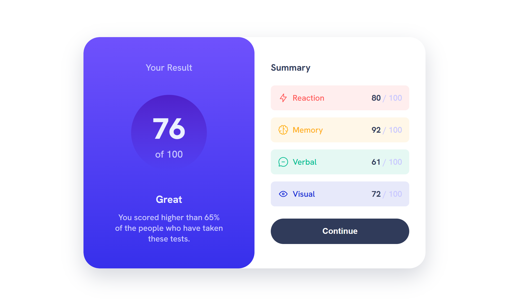

# Frontend Mentor - Results summary component solution

This is a solution to the [Results summary component challenge on Frontend Mentor](https://www.frontendmentor.io/challenges/results-summary-component-CE_K6s0maV). Frontend Mentor challenges help you improve your coding skills by building realistic projects.

## Table of contents

- [Overview](#overview)
  - [The challenge](#the-challenge)
  - [Screenshot](#screenshot)
  - [Links](#links)
- [My process](#my-process)
  - [What I learned](#what-i-learned)
  - [Useful resources](#useful-resources)
- [Author](#author)

## Overview

### The challenge

Users should be able to:

- View the optimal layout for the interface depending on their device's screen size
- See hover and focus states for all interactive elements on the page
- **Bonus**: Use the local JSON data to dynamically populate the content

### Screenshot

### Links

- **Solution:** [Frontend Mentor - Results summary component solution](https://www.frontendmentor.io/solutions/...) 🛠️
- **Live Site:** [View Live Site](https://fem-results-summary-component.pages.dev/) 🌐✨

## My process

### What I learned

1. **Handling API-like JSON Data:** I explored using the `Fetch API` to retrieve and process JSON data dynamically.
2. **JavaScript Promises and Async/Await:** I improved my understanding of asynchronous JavaScript workflows and effectively handling returned promises.

### Useful resources

- [**W3Schools: JavaScript Fetch API**](https://www.w3schools.com/js/js_api_fetch.asp): A beginner-friendly guide to understanding the Fetch API.
- [**W3Schools: JavaScript Promises**](https://www.w3schools.com/js/js_promise.asp): Excellent explanation of promises and their usage.
- [**W3Schools: JavaScript Async/Await**](https://www.w3schools.com/js/js_async.asp): A handy reference for simplifying asynchronous JavaScript.

## Author

Created by [**Fortune Iyoha**](https://linktr.ee/fortuneiyoha). 🌟 Connect with me on my [Frontend Mentor profile](https://www.frontendmentor.io/profile/fortuneiyoha) or follow me on [𝕏 (formerly Twitter)](https://x.com/fortuneiyoha) for updates and web development discussions. 💬
